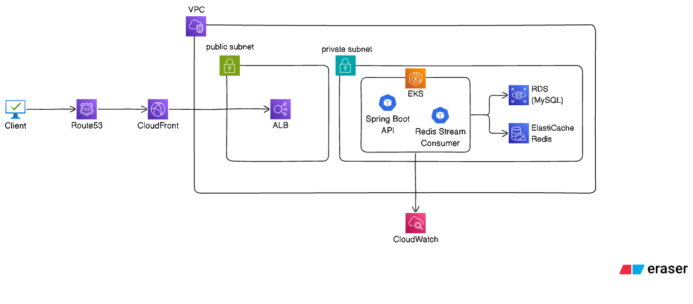

# 개요

Spring Boot와 Redis를 활용해 대량 동시 요청 환경에서 선착순 쿠폰 발급을 처리하는 프로젝트입니다.

단순 쿠폰 CRUD가 아니라, 한정 수량 쿠폰의 중복 발급, 초과 발급, 비동기 저장 실패, Consumer 장애 상황을 고려해 Redis Lua Script, Redis Stream, Pending 재처리, DLQ 구조를 설계했습니다.

상세 설계, 부하 테스트 결과, 장애 복구 시나리오 내용은 포트폴리오 PDF에 정리했습니다.

# 핵심 구현

- Redis Lua Script를 사용해 쿠폰 수량 확인, 중복 발급 확인, 발급 카운트 증가, Stream 발행을 원자적으로 처리
- Redis Stream Consumer Group을 통해 API 응답과 DB 저장 흐름 분리
- Consumer 처리 실패 시 ACK를 수행하지 않아 Pending 상태로 보존
- XPENDING + XCLAIM 기반으로 오래된 Pending 메시지 재처리
- 반복 실패 메시지는 DLQ로 이동시키고, Failure Log를 DB에 저장해 운영자가 확인 가능하도록 구성

# 아키텍처

## 운영 환경을 가정한 AWS 배포 구조
> 실제 AWS에 배포한 구조가 아니라, 운영 환경으로 확장할 경우를 가정한 아키텍처입니다.
> 


# 처리 흐름

## 쿠폰 발급 흐름

```text
Client
  -> Coupon Issue API
  -> Redis Lua Script
      - 중복 발급 여부 확인
      - 쿠폰 수량 초과 여부 확인
      - 발급 카운트 증가
      - Redis Stream 메시지 발행
  -> Redis Stream Consumer
  -> MySQL 발급 이력 저장
  -> XACK
```

### 장애 처리 흐름

```text
Consumer 처리 실패
  -> XACK 미수행
  -> Redis Pending 상태 유지
  -> XPENDING으로 재처리 대상 조회
  -> XCLAIM으로 메시지 소유권 회수
  -> 재처리 성공 시 XACK
  -> 반복 실패 시 DLQ 이동 및 Failure Log 저장
```


# 주요 검증 결과

| 검증 항목      | 목적                         | 조건                | 결과                           |
| ---------- | -------------------------- | ----------------- | ---------------------------- |
| 정상 발급 처리   | 대량 요청 상황에서 정상 발급 흐름 검증     | 10,000건 요청        | 초과 발급 0건, Pending 0건, DLQ 0건 |
| 초과 발급 방지   | 한정 수량 이상의 발급 차단 검증         | 쿠폰 수량을 초과하는 요청 발생 | issued-count가 쿠폰 수량을 초과하지 않음 |
| 중복 발급 방지   | 동일 사용자의 반복 발급 요청 차단 검증     | 동일 userId로 반복 요청  | 최초 1회만 발급                    |
| Pending 복구 | Consumer 처리 실패 후 메시지 복구 검증 | 강제 Pending 메시지 생성 | XPENDING + XCLAIM으로 재처리      |
| DLQ 격리     | 반복 실패 메시지의 별도 격리 검증        | 강제 실패 메시지 생성      | DLQ Stream에 저장               |


# Tech Stack
| Category | Technology |
|---|---|
| Language | Java 17 |
| Framework | Spring Boot |
| ORM | Spring Data JPA |
| Database | MySQL |
| In-Memory Store | Redis |
| Message Queue | Redis Stream, Consumer Group |
| Concurrency Control | Redis Lua Script |
| Failure Handling | XPENDING, XCLAIM, DLQ |
| Load Test | k6 |
| Container | Docker Compose |
| Build Tool | Gradle |