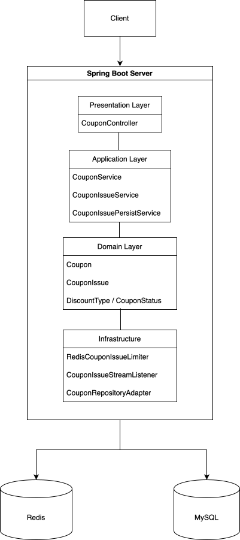
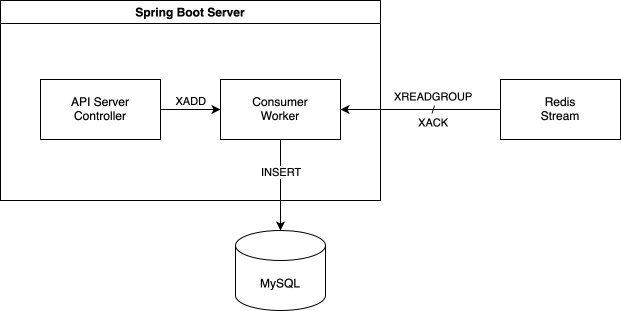

# Overview

이 프로젝트는 선착순 쿠폰 발급 시스템을 구현합니다.

주요 목표는 다음과 같습니다.

- 한정 수량 쿠폰의 초과 발급 방지
- 동일 사용자의 중복 발급 방지
- Redis Lua Script를 활용한 원자적 발급 처리
- Redis Stream 기반 비동기 저장 구조 설계
- MySQL을 통한 쿠폰 및 발급 이력 영속화

# Server Architecture

현재 구조는 다음과 같습니다.

```text
Client
  ↓
Spring Boot API Server
  ↓
Redis Lua Script
  ↓
Redis Stream
  ↓
Consumer
  ↓
MySQL
```

| Overall Architecture | Redis Consumer Architecture |
|---|---|
|  |  |

# Tech Stack
| Category | Technology |
|---|---|
| Language | Java 17 |
| Framework | Spring Boot |
| ORM | Spring Data JPA |
| Database | MySQL |
| In-Memory Store | Redis |
| Concurrency Control | Redis Lua Script |
| Container | Docker Compose |
| Build Tool | Gradle |